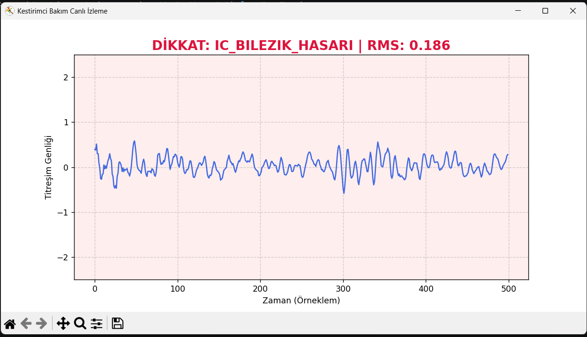

#  Akıllı Motor Durum İzleyici (Predictive Maintenance & AI)

> **"Bozulmadan önce tespit et."** > Motor titreşimlerindeki mikroskobik anormallikleri, donanım arızasına dönüşmeden önce gerçek zamanlı olarak tespit etmek için tasarlanmış Yapay Zeka tabanlı durum izleme sistemi.

**Canlı Arıza Tespit Ekranı (Ekran Görüntüsü):**

##  Problem ve Endüstriyel Çözüm
Enerji santralleri, üretim bantları ve havacılık gibi kritik endüstriyel sektörlerde, beklenmedik motor arızaları devasa üretim duruşlarına ve maliyetlere yol açar. Geleneksel bakım yöntemleri ya çok erken (parça israfı) ya da çok geç (arıza sonrası) yapılır.

**Çözüm (Kestirimci Bakım):** Bu proje, motorlardan alınan ham titreşim sinyallerini analiz ederek arızaları henüz kuluçka aşamasındayken tespit eder. Makine öğrenmesi modeli sayesinde mühendisler, bakımı tam olarak gerektiği zamanda planlayabilirler.

##  Sistem Mimarisi ve Mühendislik Yaklaşımı

Sistem, fiziksel donanım verileri ile yazılım zekasını 3 aşamalı bir boru hattı (pipeline) ile birleştirir:

1. **Veri Paketleme (Windowing):** Ham titreşim verileri, motorun anlık ritmini yakalamak için 500 örneklemlik paketlere bölünür (Gerçek zamanlı sensör akışı simülasyonu).
2. **Özellik Çıkarımı (Sinyal İşleme):** Yapay zekaya gürültülü ham veri vermek yerine, spesifik arıza imzalarını izole etmek için her paket üzerinden mühendislik metrikleri hesaplanır:
   - **RMS (Kök Ortalama Kare):** Titreşimin genel enerjisini ölçer.
   - **Standart Sapma:** Sinyal dalgalanmalarını yakalar.
   - **Maksimum/Minimum:** Ani darbe (vuruntu) kuvvetlerini tespit eder.
3. **Makine Öğrenmesi (Random Forest):**
   Çıkarılan bu özellikler kullanılarak eğitilen *Random Forest Classifier* algoritması; motorun durumunu *Sağlıklı*, *İç Bilezik Hasarı*, *Dış Bilezik Hasarı* veya *Bilya Hasarı* olarak sınıflandıran güçlü bir karar matrisi oluşturur.

## 🛠️ Proje Dosyaları
* `veri_birlestir.py`: Laboratuvar verilerinin (.mat) temizlenmesi ve birleştirilmesi.
* `ozellik_cikar.py`: Sinyal işleme ve matematiksel özellik (RMS vb.) çıkarımı.
* `model_egit.py`: Scikit-learn ile modelin eğitilmesi ve performans analizi.
* `canli_simulasyon.py` / `canli_grafik.py`: Matplotlib ile gerçek zamanlı akan veri simülasyonu ve arıza tespit arayüzü.
